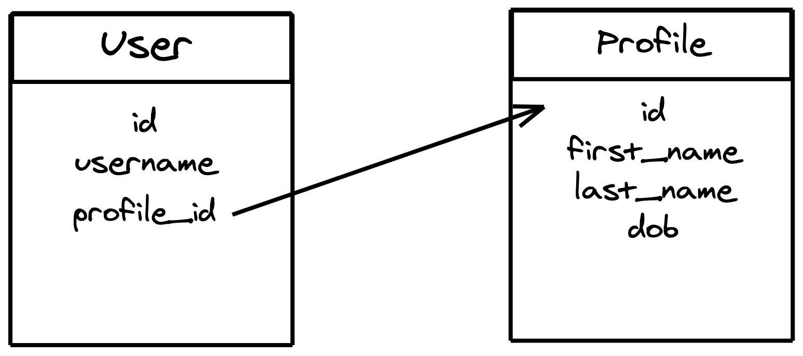
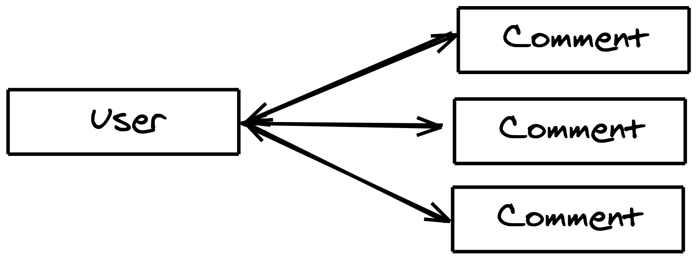
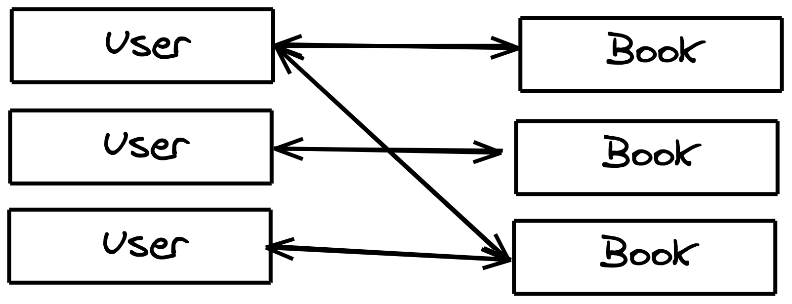

[Sequelize](https://sequelize.org/) is an Object relational library (ORM) that helps to communicate between database (Postgres, MySQL, MariaDB, SQLite and Microsoft SQL Server) and programming models on the NodeJS end.

This blog exclusively deals with how to setup associations in sequelize. Primary knowledge of NodeJS, Express and SequelizeJS is recommended.

## Associations

An association (also called a relationship) models the way two classes are connected to each other.

Sequelize supports three types of associations between their models:

- One to One relationship
- One to Many relationship
- Many to Many relationship

## Implementation in relational databases

Relational databases implement associations/relationships with the help of foreign keys.



User model contains a column `profile_id` which connects it to Profile model by referencing `id` column there. With SQL, you can use `JOIN` queries to retrieve information from associated Profile table when a User is fetched.

Adding foreign keys also gives us control over actions to be taken when updating/deleting associated models.

## Associations in Sequelize

In order to implement three of these standard associations, Sequelize provides us four APIs:

- `hasOne` association
- `belongsTo` association
- `hasMany` association
- `belongsToMany` association

To create associations, we have to use combinations of these together:

- To create a One-to-One relationship, the `hasOne` and `belongsTo` associations are used together.
- To create a One-to-Many relationship, the `hasMany` and `belongsTo` associations are used together.
- To create a Many-to-Many relationship, two `belongsToMany` calls are used together.

Let us explore each of these one by one.

In all examples below, `Book` and `User` are models that have already been defined. You can define a model with:

```javascript
const User = sequelize.define("User", {
  name: {
    type: DataTypes.STRING,
  },
});
```

[Docs](https://sequelize.org/master/manual/model-basics.html)

### One to One relationship


Here, User and Profile share a one to one relationship. A user has a profile and profile has a user associated with it.

#### Creating a One to One association

A One-to-One relationship could be in a likely scenario be merged back to a single table. So, this relationship is rarely used.

To create a one to one relationship we have to find the optional model in the relationship. In our example, `User` and `Profile` have a one-to-one relationship. Here User can exist without a Profile, but the vice versa is not possible.

This means, we will insert `userId` field to `Profile` model's table:

```javascript
User.hasOne(Profile);
Profile.belongsTo(User);
```

translated to SQL:

```sql
CREATE TABLE IF NOT EXISTS "users" (
  /* ... */
);
CREATE TABLE IF NOT EXISTS "profiles" (
  /* ... */
  "userId" INTEGER REFERENCES "users" ("id") ON DELETE SET NULL ON UPDATE CASCADE
);
```

### One to Many relationship



Here user and comments share a one to many relationship. Each user can make multiple comments while each comment is associated with only a single user.

#### Creating a One to Many relationship

Unline 1-1 relationship there isn't a question of where to place the foreign keys here.

```javascript
User.hasMany(Comment);
Comment.belongsTo(User);
```

The foreign key `userId` is on each row of `Comment`

### Many to Many



User is marking down Books that he has read. Each user can mark as many books as they want, creating a many to many association between User and Books. Contrary to the earlier scenario with comments, a Book also can be connected to many number of Users.

Each model involved in the relationship can be connected to multiple targets. But we cannot represent this relationship with a single foreign key on a model. If you're thinking array of foreign keys, that's ineffective to do joins on. Instead we use this concept called a Junction table; to borrow a diagram from Wikipedia:


Here `actor_film_mapping` table is used as a junction table to link together actor and film tables.

To represent relationship in Sequelize:

```javascript
User.belongsToMany(Book, {
  through: "UserBooks",
});
Book.belongsToMany(User, {
  through: "UserBooks",
});
```

`UserBooks` representing the name of the junction table model.

Sequelize also allows you to specify a model instead of string and you can add your own columns to the junction table.

```javascript
const UserBooks = sequelize.define("UserBooks", {
  userId: {
    type: DataTypes.INTEGER, // given primary key is integer
  },
  bookId: {
    type: DataTypes.INTEGER,
  },
  rating: {
    type: DataTypes.INTEGER, // our own column added to the model
  },
});
User.belongsToMany(Book, {
  through: UserBooks, // sequelize uses the UserBooks model instead of creating one.
});
Book.belongsToMany(User, {
  through: UserBooks,
});
```

## Aliasing an association

Sometimes, you end up having multiple relationships between entities, for example what if our Users could favorite Books too? As you can guess from the title, you can alias the relationship giving it a unique name.

```javascript
User.belongsToMany(Book, {
  through: FavBooks,
  as: "favorites",
});
Book.belongsToMany(User, {
  through: FavBooks,
  as: "favorites",
});
User.belongsToMany(Book, {
  through: ReadBooks,
  as: "read",
});
Book.belongsToMany(User, {
  through: ReadBooks,
  as: "read",
});
```

This is same in the case of all types of relationships.

---

There is a lot more to cover on creating these relationships like customising keys or changing how update or delete affects these relationships. I do plan to cover them, but [documentation](https://sequelize.org/master/manual/assocs.html) should be your best guide if you understand these relationships better.

Have fun 🎉
